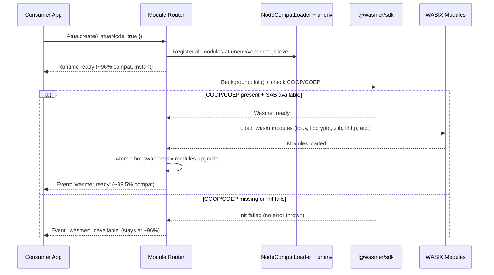
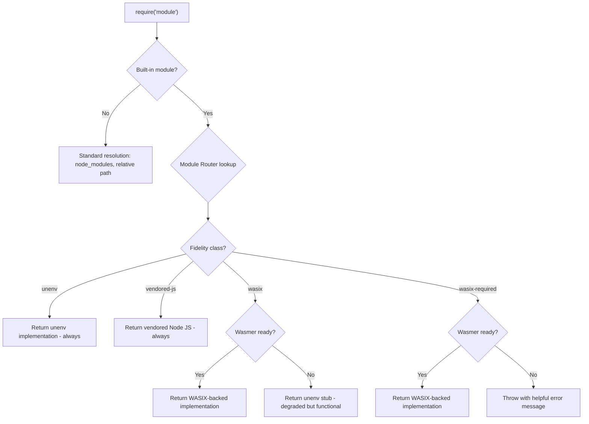
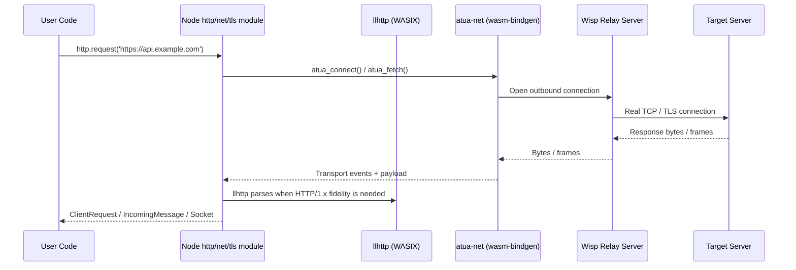
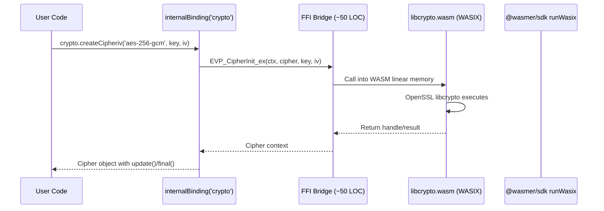
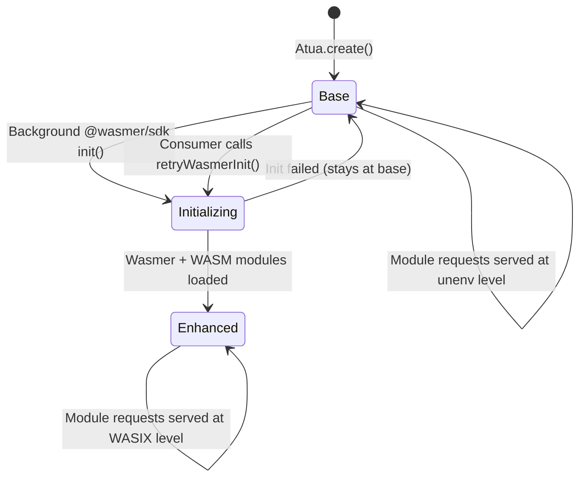

# Core Flows — @aspect/atua-node

**Parent:** `spec:a7839341-19b5-40cd-999f-4fc68df128e4/e8d6adc2-f1f5-41ba-9b3b-f72a74dd337c`

These flows describe the runtime lifecycle of `@aspect/atua-node` — what happens when the system boots, when user code requests a module, when networking occurs, and when things fail. The "user" here is either the consumer application developer, the code running inside Atua, or the system itself.

---

## Flow 1: Runtime Initialization & Progressive Enhancement

**Description:** The system boots in two phases — instant base availability, then background WASIX upgrade.

**Trigger:** Consumer application calls `Atua.create()` with atua-node enabled.

**Steps:**

1. Consumer calls `Atua.create()` — runtime initializes instantly with all `unenv` and `vendored-js` modules registered. App is fully functional at ~96% compat.
2. In the background, the Module Router attempts `@wasmer/sdk` `init()`. This checks for COOP/COEP headers and SharedArrayBuffer availability.
3. If Wasmer initializes: `.wasm` modules are loaded (first visit ~2s, cached visits near-instant). The Router atomically hot-swaps `wasix` class modules to their WASIX-backed implementations. A `wasmer:ready` event fires.
4. If Wasmer fails: No error is thrown. A `wasmer:unavailable` event fires. All modules remain at their unenv level. The runtime is fully functional at 96%.
5. `wasix-required` modules (`vm`, `child_process`, `worker_threads`, `cluster`) throw helpful errors before Wasmer is ready, and become functional after.

---

## Flow 2: Module Resolution

**Description:** What happens when running code calls `require()` or `import` for a Node built-in module.

**Trigger:** User code executes `require('crypto')`, `require('fs')`, `import 'http'`, etc.

**Steps:**

1. User code calls `require('crypto')` (or any Node built-in).
2. The Module Router intercepts and looks up the module's fidelity class.
3. **`unenv` class** (path, util, events, assert): Returns the unenv implementation. Always available. Never changes. No WASM involved.
4. **`vendored-js` class** (stream, timers, process): Returns vendored Node.js internal JS. Runs on browser V8 natively. If Wasmer is ready, scheduling integrates with the libuv event loop.
5. **`wasix` class** (crypto, fs, http, zlib, net, tls, buffer, os, dns): If Wasmer is ready → returns the WASIX-backed implementation (e.g., libcrypto for crypto, zlib for compression). If Wasmer is NOT ready → returns the unenv stub (degraded but functional — e.g., WebCrypto for crypto).
6. **`wasix-required` class** (vm, child_process, worker_threads, cluster): If Wasmer is ready → returns the WASIX-backed implementation. If NOT → throws a clear error: "Module 'vm' requires WASIX. Ensure COOP/COEP headers are set."
7. Resolution is synchronous from the caller's perspective — the Router has already determined which backend is available.

---

## Flow 3: Graceful Degradation

**Description:** What happens when WASIX cannot initialize — the system remains fully functional at the base compatibility level.

**Trigger:** `@wasmer/sdk` `init()` fails due to missing COOP/COEP, no SharedArrayBuffer, network error loading WASM, or browser incompatibility.

**Steps:**

1. The Module Router detects Wasmer initialization failure. No exception is thrown to the consumer.
2. A `wasmer:unavailable` event fires with a reason string (e.g., "SharedArrayBuffer not available — COOP/COEP headers required").
3. All `unenv` and `vendored-js` modules continue working normally — they never depended on WASIX.
4. All `wasix` class modules stay on their unenv/browser fallbacks: `crypto` uses WebCrypto (partial), `fs` uses AtuaFS via unenv bridge, `zlib` uses CompressionStream, `http` uses existing ServiceWorker + fetch stubs.
5. All `wasix-required` modules (`vm`, `child_process`, `worker_threads`, `cluster`) throw descriptive errors when called, explaining what's needed.
6. The consumer application can listen for `wasmer:unavailable` and adjust its behavior (e.g., show a banner: "Enhanced Node.js compatibility unavailable — some features may not work").
7. If environment changes (e.g., user enables COOP/COEP), the consumer can call a re-initialization method to retry Wasmer setup without reloading.

---

## Flow 4: Network Request via atua-net

**Description:** How client-side Node networking APIs (`http.request`, `https.request`, `net.connect`, `tls.connect`, `fetch`) route through atua-net's Wisp relay for real TCP/TLS connectivity, while `listen()`-style server flows use a host preview/server adapter when the Atua host provides one.

**Trigger:** User code calls `http.request()`, `https.get()`, `net.connect()`, or `fetch()`.

**Steps:**

1. User code calls a networking API (`http.request`, `https.get`, `net.connect`, `tls.connect`, `fetch`).
2. For outbound/client-side APIs, the Node module facade delegates transport to `atua-net`. `atua_fetch()` can back fetch-style flows, while `atua_connect()` and the stream APIs back `net` / `tls` sockets and raw HTTP/1.x compatibility paths.
3. `atua-net` opens a TCP stream through the Wisp relay: a WebSocket to the relay server multiplexes real TCP connections.
4. llhttp (compiled to WASIX) is used when Node-compatible HTTP/1.x parsing semantics are required — ensuring exact parser error codes, malformed-request tolerance, and header handling. It complements `atua-net`'s transport and TLS rather than replacing them.
5. Response data is surfaced back through the Node facade as standard `ClientRequest`, `IncomingMessage`, `TLSSocket`, or `net.Socket` objects.
6. For server-style APIs (`http.createServer().listen()`), the runtime uses a host preview/server adapter (for example, Atua's preview infrastructure) when available; otherwise listen-style APIs fail with descriptive unsupported errors rather than pretending to bind a real socket.
7. **Swap interface:** The client-side net-bridge adapter has clean seams — if WASIX networking ships in `@wasmer/sdk` later, the adapter can route outbound/client networking through WASIX `sock_*` syscalls instead of `atua-net` without changing module-facing APIs.

---

## Flow 5: WASIX C Library Execution

**Description:** How a compiled C library (libcrypto, zlib, libuv, etc.) is loaded and called from JavaScript.

**Trigger:** User code calls an API backed by a WASIX C library (e.g., `crypto.createCipheriv('aes-256-gcm', key, iv)`).

**Steps:**

1. User code calls a Node crypto/zlib/url API.
2. The vendored Node.js internal code calls `internalBinding('crypto')` (or `'zlib'`, etc.) — the same call Node's own code makes.
3. The `internalBinding` dispatch routes to a thin FFI bridge stub (~50 lines each). The stub marshals JavaScript arguments to the C function signature and calls into the WASM module.
4. The WASIX module executes the real C library code (e.g., OpenSSL's `EVP_CipherInit_ex`) inside WASM linear memory, managed by `@wasmer/sdk`.
5. Results are returned through the FFI bridge back to the vendored Node JS, which wraps them in the standard Node API shape.
6. User code receives the same object it would get from real Node.js — same methods, same error codes, same behavior.

---

## Flow 6: Native Addon Loading

**Description:** How `require()` for a native addon (e.g., `better-sqlite3`) resolves through the addon registry to a pre-compiled WASIX module.

**Trigger:** User code calls `require('better-sqlite3')` or any package that depends on a native addon.

**Steps:**

1. User code calls `require('better-sqlite3')`. Standard resolution finds the package in `node_modules`.
2. The package's binding code calls `process.dlopen()` or `require()` on a `.node` binary.
3. The addon registry intercepts and checks its mapping: `{ 'better-sqlite3': 'wasmer/better-sqlite3' }`.
4. If the addon is registered: The registry lazily loads the pre-compiled WASIX module from the Wasmer registry (`Wasmer.fromRegistry(...)`) or from a bundled `.wasm` file.
5. The WASIX module initializes and its exports are returned as the addon's module.exports — the calling code receives a working module with all expected methods.
6. If the addon is NOT registered: A helpful error is thrown: "Native addon 'xyz' is not available. Register a WASIX build via `addonRegistry.register()`."
7. The registry is extensible — consumer applications can register their own WASIX-compiled addons: `addonRegistry.register('my-addon', { package: 'my-wasix-build' })`.

---

## State Machine: Module Router Lifecycle

| State | Compat Level | wasix modules | wasix-required modules |
|-------|-------------|---------------|----------------------|
| **Base** | ~96% | unenv stubs (degraded) | Throw with helpful error |
| **Initializing** | ~96% | unenv stubs (degraded) | Throw with helpful error |
| **Enhanced** | ~99.5% | WASIX-backed (full fidelity) | Functional |
