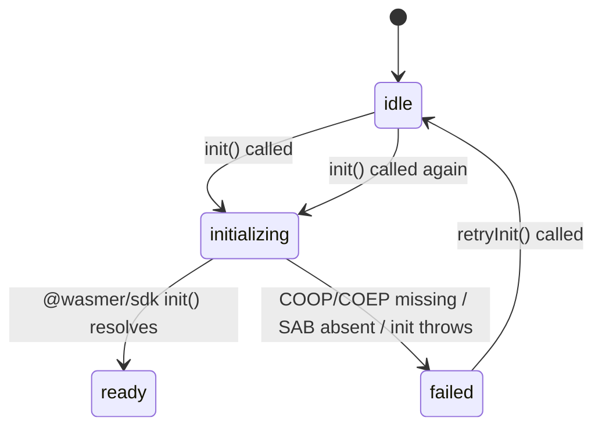

I have created the following plan after thorough exploration and analysis of the codebase. Follow the below plan verbatim. Trust the files and references. Do not re-verify what's written in the plan. Explore only when absolutely necessary. First implement all the proposed file changes and then I'll review all the changes together at the end.

## Observations

The workspace is empty except for two markdown files. This is a greenfield TypeScript package (`@aspect/atua-node`) built on top of `@wasmer/sdk`. The architecture is a progressive-enhancement layer: the Module Router boots instantly at ~96% compat (unenv base), then upgrades to ~99.5% when `@wasmer/sdk` initializes successfully in the background. The four fidelity classes (`unenv`, `vendored-js`, `wasix`, `wasix-required`) drive all dispatch logic.

## Approach

Create all files in the exact order of their dependency graph: config files → types → `WasmerInitializer` → `ModuleRouter` → registry → entry point → stubs → tests. No existing code to integrate with at this stage; all integration points (AtuaFS, atua-net, NativeModuleLoader) are deferred to later tickets and represented only as stubs here.

---

## Implementation Steps

### Step 1 — Package Config Files

**`package.json`**
- `name`: `@aspect/atua-node`, `version`: `0.1.0`, `type`: `module`
- `main`: `dist/index.cjs`, `module`: `dist/index.js`, `types`: `dist/index.d.ts`
- `exports` map: `.` → `{ import: dist/index.js, require: dist/index.cjs, types: dist/index.d.ts }`
- `dependencies`: `@wasmer/sdk` (latest stable, e.g. `^0.10.0`)
- `devDependencies`: `typescript`, `tsup`, `vitest`, `@types/node`, `happy-dom`
- `scripts`: `build` → `tsup`, `test` → `vitest run`, `typecheck` → `tsc --noEmit`

**`tsconfig.json`**
- `target`: `ES2022`, `module`: `ESNext`, `moduleResolution`: `Bundler`
- `strict`: `true`, `lib`: `["ES2022", "DOM"]`
- `outDir`: `dist`, `rootDir`: `src`, `declaration`: `true`
- `include`: `["src"]`

**`tsup.config.ts`**
- `entry`: `{ index: 'src/index.ts' }`
- `format`: `['esm', 'cjs']`
- `dts`: `true`
- `external`: `['@wasmer/sdk']`
- `sourcemap`: `true`

**`vitest.config.ts`**
- `environment`: `happy-dom`
- `globals`: `true`
- `include`: `['tests/**/*.test.ts']`

**`.gitignore`**
- `node_modules/`, `dist/`, `*.tsbuildinfo`

---

### Step 2 — Type Definitions (`src/types/index.ts`)

Define and export all shared types:

- `FidelityClass`: `'unenv' | 'vendored-js' | 'wasix' | 'wasix-required'`
- `ModuleFactory`: `() => unknown`
- `ModuleRegistryEntry` interface:
  - `name: string`
  - `fidelityClass: FidelityClass`
  - `baseImpl: ModuleFactory`
  - `wasixImpl: ModuleFactory | null`
  - `wasmArtifact: string | null`
  - `loaded: boolean`
  - `provider: string`
- `RouterState`: `'base' | 'initializing' | 'enhanced'`
- `InitializerState`: `'idle' | 'initializing' | 'ready' | 'failed'`
- `AtuaNodeOptions` interface:
  - `cdnBase?: string`
  - `skipWasmerInit?: boolean`
- `WasmerUnavailableReason` interface:
  - `code: 'no-coop-coep' | 'no-shared-array-buffer' | 'init-error' | 'unsupported'`
  - `message: string`

---

### Step 3 — Wasmer Initializer (`src/wasmer/WasmerInitializer.ts`)



Implement `WasmerInitializer` class:

- **Private fields**: `_state: InitializerState = 'idle'`, `_failureReason: WasmerUnavailableReason | null = null`, `_readyCallbacks: Array<() => void> = []`, `_failureCallbacks: Array<(reason: WasmerUnavailableReason) => void> = []`
- **Getters**: `get isReady()` returns `this._state === 'ready'`; `get state()` returns `_state`; `get failureReason()` returns `_failureReason`
- **`async init()`**:
  1. Guard: if `_state !== 'idle'` return immediately (double-init protection)
  2. Set `_state = 'initializing'`
  3. Check `crossOriginIsolated` (global browser property) — if `false`, set `_state = 'failed'`, set `_failureReason = { code: 'no-coop-coep', message: '...' }`, call all `_failureCallbacks`, return
  4. Check `typeof SharedArrayBuffer !== 'undefined'` — if absent, set `_state = 'failed'`, `_failureReason = { code: 'no-shared-array-buffer', message: '...' }`, call all `_failureCallbacks`, return
  5. Wrap in try/catch: `await init()` from `@wasmer/sdk`
  6. On success: `_state = 'ready'`, call all `_readyCallbacks`
  7. On catch: `_state = 'failed'`, `_failureReason = { code: 'init-error', message: err.message }`, call all `_failureCallbacks`
- **`async retryInit()`**: Reset `_state = 'idle'`, `_failureReason = null`, then call `this.init()`
- **`onReady(cb: () => void)`**: Push to `_readyCallbacks`; if already ready, call `cb` immediately
- **`onFailure(cb: (reason: WasmerUnavailableReason) => void)`**: Push to `_failureCallbacks`; if already failed, call `cb` immediately with `_failureReason`

---

### Step 4 — Module Router (`src/router/ModuleRouter.ts`)

Implement `ModuleRouter` class:

- **Private fields**:
  - `_registry: Map<string, ModuleRegistryEntry>`
  - `_state: RouterState = 'base'`
  - `_initializer: WasmerInitializer`
  - `_eventListeners: Map<string, Function[]>`

- **Constructor** takes `WasmerInitializer`:
  - Wire `_initializer.onReady(() => { this._state = 'enhanced'; this._emit('wasmer:ready') })`
  - Wire `_initializer.onFailure((reason) => { this._state = 'base'; this._emit('wasmer:unavailable', reason) })`
  - Note: set `_state = 'initializing'` when init begins — this is driven by the initializer's state; the router can check `_initializer.state === 'initializing'` or track it via a separate flag

- **`register(entry: ModuleRegistryEntry)`**: Set `_registry.set(entry.name, entry)`

- **`resolve(moduleName: string): unknown`** — implements Flow 2 dispatch:

  ```
  if not in registry → throw Error(`Unknown module: '${moduleName}'`)
  
  switch fidelityClass:
    'unenv' | 'vendored-js' → return entry.baseImpl()
    'wasix' →
      if _initializer.isReady && entry.loaded && entry.wasixImpl → return entry.wasixImpl()
      else → return entry.baseImpl()
    'wasix-required' →
      if _initializer.isReady && entry.loaded && entry.wasixImpl → return entry.wasixImpl()
      else → throw Error(`Module '${moduleName}' requires WASIX. Ensure COOP/COEP headers (Cross-Origin-Opener-Policy: same-origin, Cross-Origin-Embedder-Policy: require-corp) are set on your server.`)
  ```

- **`get state()`**: Returns `_state`

- **Event methods**:
  - `onWasmerReady(listener: () => void)`: Register listener for `'wasmer:ready'`
  - `onWasmerUnavailable(listener: (reason: WasmerUnavailableReason) => void)`: Register listener for `'wasmer:unavailable'`
  - `off(event: string, listener: Function)`: Remove listener from `_eventListeners`
  - `_emit(event: string, ...args: unknown[])`: Call all listeners for the event

- **Router state tracking**: When `WasmerInitializer.init()` is called (fire-and-forget from `AtuaNode.create()`), the router should transition to `'initializing'`. Wire this by having the constructor also register a callback that sets `_state = 'initializing'` before init begins — or expose a `_onInitStart()` private method called from `AtuaNode.create()` after firing init.

---

### Step 5 — Registry Population (`src/router/registry.ts`)

Export `populateRegistry(router: ModuleRouter): void`:

Register all entries using `router.register(...)`. Each entry has:
- `baseImpl`: arrow function returning `{ notImplemented: true, moduleName: '<name>' }`
- `wasixImpl`: `null`
- `wasmArtifact`: `null`
- `loaded`: `false`
- `provider`: `'unenv'` for unenv class, `'atua'` for others

| `fidelityClass` | Modules |
|---|---|
| `'unenv'` | `path`, `util`, `events`, `assert`, `querystring`, `string_decoder`, `punycode` |
| `'vendored-js'` | `stream`, `timers`, `process`, `console` |
| `'wasix'` | `crypto`, `fs`, `http`, `https`, `zlib`, `net`, `tls`, `buffer`, `os`, `dns`, `url` |
| `'wasix-required'` | `vm`, `child_process`, `worker_threads`, `cluster` |

---

### Step 6 — Entry Point (`src/index.ts`)

Implement `AtuaNode` class with static `create(options?: AtuaNodeOptions): ModuleRouter`:

1. Instantiate `new WasmerInitializer()`
2. Instantiate `new ModuleRouter(initializer)`
3. Call `populateRegistry(router)`
4. If `!options?.skipWasmerInit`:
   - Set router state to `'initializing'` (call internal method or set flag)
   - Fire-and-forget: `initializer.init()` — no `await`, no `.catch()` needed (errors are handled internally)
5. Return `router`

Re-export from this file:
- All types from `src/types/index.ts`
- `ModuleRouter` from `src/router/ModuleRouter.ts`
- `WasmerInitializer` from `src/wasmer/WasmerInitializer.ts`

---

### Step 7 — Stub Files

Create minimal placeholder files — each exports a single placeholder class or object so TypeScript resolves imports in later tickets:

**Bridge stubs** (each exports a class with a `// TODO: implement in ticket X` comment):
- `src/bridges/fs-bridge.ts` → export class `FsBridge`
- `src/bridges/net-bridge.ts` → export class `NetBridge`
- `src/bridges/thread-bridge.ts` → export class `ThreadBridge`
- `src/bridges/proc-bridge.ts` → export class `ProcBridge`

**Binding stubs** (each exports a placeholder object):
- `src/bindings/binding-crypto.ts`
- `src/bindings/binding-zlib.ts`
- `src/bindings/binding-url.ts`
- `src/bindings/binding-encoding.ts`
- `src/bindings/binding-http-parser.ts`
- `src/bindings/binding-uv.ts`
- `src/bindings/binding-vm.ts`

**Empty placeholder files**:
- `src/vendor/.gitkeep`
- `wasm/.gitkeep`

---

### Step 8 — Tests

**`tests/wasmer-initializer.test.ts`**

Use `vi.stubGlobal` to control `crossOriginIsolated` and `SharedArrayBuffer`. Mock `@wasmer/sdk` with `vi.mock('@wasmer/sdk', ...)` providing a controllable `init` function.

| Test | Setup | Expected |
|---|---|---|
| Success path | `crossOriginIsolated=true`, SAB defined, `init` resolves | `state === 'ready'`, `isReady === true` |
| COOP/COEP failure | `crossOriginIsolated=false` | `state === 'failed'`, `failureReason.code === 'no-coop-coep'` |
| SAB failure | `crossOriginIsolated=true`, `SharedArrayBuffer` deleted | `state === 'failed'`, `failureReason.code === 'no-shared-array-buffer'` |
| init() throws | `crossOriginIsolated=true`, SAB defined, `init` rejects | `state === 'failed'`, `failureReason.code === 'init-error'` |
| retryInit() | Fail first, then stub success, call `retryInit()` | `state === 'ready'` after retry |
| Double-init guard | Call `init()` twice concurrently | Second call is no-op; `init` from SDK called exactly once |

**`tests/module-router.test.ts`**

Instantiate `WasmerInitializer` with `skipWasmerInit` (or mock it), create `ModuleRouter`, call `populateRegistry`.

| Test | Setup | Expected |
|---|---|---|
| unenv resolve | Any state | Returns `baseImpl()` result |
| vendored-js resolve | Any state | Returns `baseImpl()` result |
| wasix when not ready | Wasmer not ready | Returns `baseImpl()` (degraded) |
| wasix when ready + loaded | Set `entry.loaded=true`, `entry.wasixImpl` set, initializer mocked ready | Returns `wasixImpl()` result |
| wasix-required not ready | Wasmer not ready | Throws with COOP/COEP message |
| wasix-required ready + loaded | Initializer mocked ready, `entry.loaded=true`, `wasixImpl` set | Returns `wasixImpl()` result |
| Unknown module | `resolve('nonexistent')` | Throws `Unknown module` error |

**`tests/events.test.ts`**

| Test | Setup | Expected |
|---|---|---|
| `wasmer:unavailable` fires on failure | Mock init to fail | Listener receives `WasmerUnavailableReason` |
| `off()` removes listener | Register then remove listener, trigger event | Listener not called |
| State: base → initializing on init start | Call `AtuaNode.create()` without `skipWasmerInit` | Router state is `'initializing'` immediately after create |
| State stays base on failure | Init fails | Router state returns to `'base'` |

---

### Final Directory Structure

```
atua-node/
├── package.json
├── tsconfig.json
├── tsup.config.ts
├── vitest.config.ts
├── .gitignore
├── wasm/
│   └── .gitkeep
├── src/
│   ├── index.ts
│   ├── types/
│   │   └── index.ts
│   ├── wasmer/
│   │   └── WasmerInitializer.ts
│   ├── router/
│   │   ├── ModuleRouter.ts
│   │   └── registry.ts
│   ├── bridges/
│   │   ├── fs-bridge.ts
│   │   ├── net-bridge.ts
│   │   ├── thread-bridge.ts
│   │   └── proc-bridge.ts
│   ├── bindings/
│   │   ├── binding-crypto.ts
│   │   ├── binding-zlib.ts
│   │   ├── binding-url.ts
│   │   ├── binding-encoding.ts
│   │   ├── binding-http-parser.ts
│   │   ├── binding-uv.ts
│   │   └── binding-vm.ts
│   └── vendor/
│       └── .gitkeep
└── tests/
    ├── wasmer-initializer.test.ts
    ├── module-router.test.ts
    └── events.test.ts
```