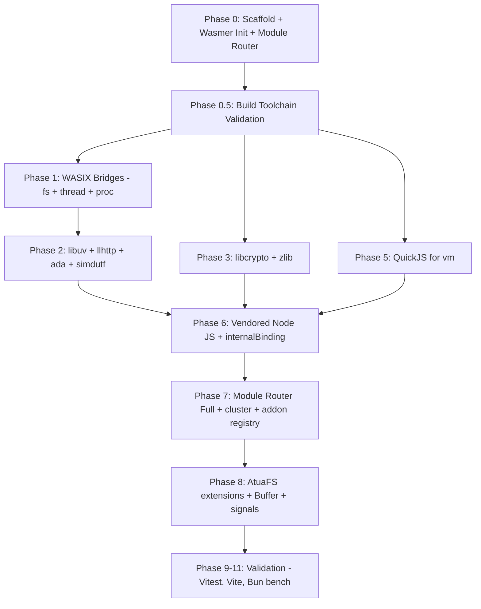
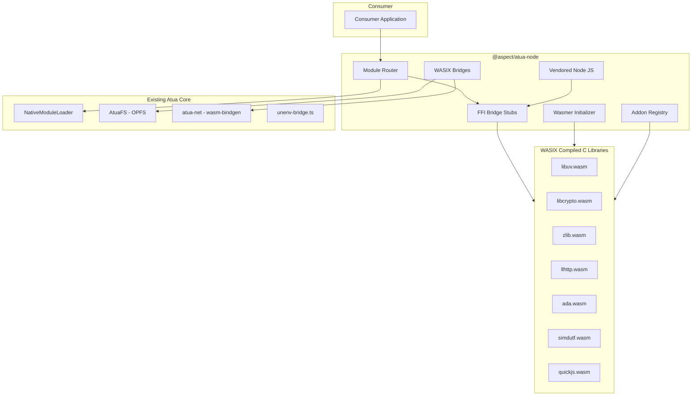
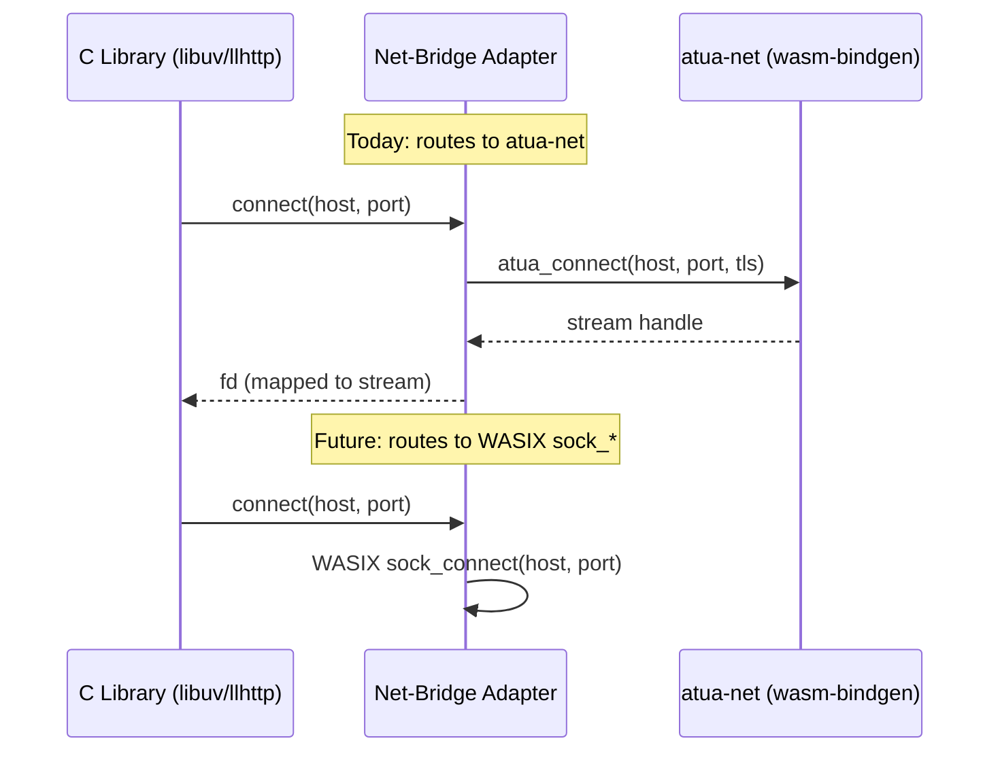

# Tech Plan — @aspect/atua-node

**Parent:** `spec:a7839341-19b5-40cd-999f-4fc68df128e4/e8d6adc2-f1f5-41ba-9b3b-f72a74dd337c`
**Flows:** `spec:a7839341-19b5-40cd-999f-4fc68df128e4/9d8e95a2-8fa6-4df2-95e6-2f7c23480ac5`

---

## 1. Architectural Approach

### 1.1 Two-WASM-World Coexistence

`@aspect/atua-node` introduces a second WASM compilation target alongside Atua's existing WASM usage. These two worlds are architecturally independent:

| World | Target | Toolchain | Runtime | Purpose |
|-------|--------|-----------|---------|---------|
| Existing | `wasm32-unknown-unknown` | wasm-pack + wasm-bindgen | Browser JS direct | atua-net, wa-sqlite, esbuild-wasm |
| New (WASIX) | `wasm32-wasmer-wasi` | wasi-sdk + wasix-libc | @wasmer/sdk `runWasix()` | libuv, libcrypto, zlib, llhttp, ada, simdutf, QuickJS |

The two worlds never call each other directly. TypeScript mediates all cross-world communication: the Module Router dispatches to either an existing unenv module OR a WASIX-backed module, and the net-bridge adapter connects WASIX C libraries to `atua-net` for networking.

### 1.2 Key Architectural Decisions

| Decision | Choice | Trade-off |
|----------|--------|-----------|
| Module Router position | Wraps `NativeModuleLoader`, does not replace it | Zero changes to existing Atua core. Router intercepts first, falls through to existing loader for unenv modules |
| WASM distribution | Dual: bundled in npm + CDN lazy-fetch option | Larger npm package (~8-15MB) but offline-capable. CDN option for lighter deploys |
| libuv approach | Full libuv compiled to WASIX, with TS phase-ordering shim as initial implementation | Phase shim ships first (lower risk), full libuv replaces it (higher fidelity) |
| Networking | atua-net (existing, `wasm32-unknown-unknown`) | No WASIX socket dependency. atua-net already production-grade with 100 tests |
| Repo structure | Standalone repo, monorepo-addable later | Clean C build isolation. Can be consumed as npm dependency or moved into monorepo |
| FFI pattern | `runWasix()` for lifecycle, mounts, and threading plus an exported C shim ABI for library calls | WASIX modules boot under `@wasmer/sdk`, while JS talks to a small stable exported ABI and shared linear memory through thin FFI bridges |
| C library philosophy | Compile real C libraries, not translations | Exact API parity. Node's bindings call the same functions they always call |

### 1.3 Build Toolchain (Corrected)

The original plan specified Emscripten (`emcc`). Research confirmed the correct WASIX toolchain:

- **Compiler**: `clang` from `wasi-sdk`
- **Sysroot**: `wasix-libc` sysroot (fork of `wasi-libc`)
- **CMake**: toolchain file at `wasix-sysroot/clang-wasm.cmake_toolchain`
- **Output**: pure `.wasm` files (no JS glue code)
- **Runtime**: loaded via `WebAssembly.compileStreaming(fetch(url))` + `runWasix(module, opts)`

### 1.4 Phase Structure

| Phase | Goal | Depends On | Risk | Effort |
|-------|------|------------|------|--------|
| **0** | Package scaffold, `@wasmer/sdk` browser init, Module Router skeleton | Nothing | Low | 1 session |
| **0.5** | wasi-sdk + wasix-libc installed, CMake config, first C "hello world" compiled and run in browser | Phase 0 | Medium | 1 session |
| **1** | WASIX bridges: fs-bridge (→ AtuaFS), thread-bridge (→ Workers + SAB), proc-bridge (→ Worker isolation). Net-bridge as adapter to atua-net | Phase 0.5 | Medium | 3 sessions |
| **2** | libuv (with TS phase shim initially, full WASIX later) + llhttp + ada + simdutf compiled | Phase 1 | High (libuv) | 3-4 sessions |
| **3** | libcrypto (OpenSSL 3.x, no libssl) + zlib compiled | Phase 0.5 | Medium | 2 sessions |
| **4** | ~~µSockets + uWebSockets~~ **DEFERRED** — WASIX networking not available | — | — | — |
| **5** | QuickJS compiled for `vm` module | Phase 0.5 | Low | 1 session |
| **6** | Vendored Node JS facades (`stream`, `timers`, `process`, `http` / `https`, `net` / `tls`, `dns`, `os`) + `internalBinding()` stubs to Tier 1 C libs | Phases 2, 3, 5 | Low-Medium | 2 sessions |
| **7** | Full Module Router with hot-swap, cluster (browser Workers), addon registry | Phase 6 | Low-Medium | 2-3 sessions |
| **8** | AtuaFS extensions (symlinks, hardlinks, permissions), proper Buffer, signal mapping | Phases 1, 6, 7 | Low | 1-2 sessions |
| **9-11** | Validation: Vitest, Vite dev server, Bun bench snippets | Phases 1-8 | Medium | 3-5 sessions |

**Parallelizable**: Phases 3 (crypto/zlib) and 5 (QuickJS) can run in parallel with Phases 1-2 since they only depend on Phase 0.5.

### 1.5 Failure Mode Analysis

| Failure | Impact | Recovery |
|---------|--------|----------|
| `@wasmer/sdk` `init()` fails | No WASIX modules available | Graceful degradation to 96% unenv base. `wasmer:unavailable` event fires |
| COOP/COEP headers missing | SharedArrayBuffer unavailable → Wasmer can't start | Same as init failure. Consumer notified via event |
| `.wasm` file fails to load (network) | Specific module unavailable | Per-module fallback to unenv. Other WASIX modules unaffected |
| WASIX module crashes at runtime | C library bug in WASM | Catch at FFI bridge, return error to caller. Other modules unaffected |
| atua-net Wisp relay unreachable | All networking fails | Same behavior as existing Atua — networking depends on relay |
| C library won't compile to WASIX | Specific module can't be built | Ship without that module, fall back to unenv for it |

---

## 2. Data Model

### 2.1 Module Registry

The core data structure is the Module Router's registry — a mapping of Node built-in module names to their implementations at each fidelity level.

| Field | Type | Description |
|-------|------|-------------|
| `name` | string | Node module name (e.g., `'crypto'`, `'fs'`, `'vm'`) |
| `fidelityClass` | enum | `'unenv'` · `'vendored-js'` · `'wasix'` · `'wasix-required'` |
| `baseImpl` | ModuleFactory | Always-available implementation (unenv/browser polyfill) |
| `wasixImpl` | ModuleFactory or null | WASIX-backed implementation, loaded on demand |
| `wasmArtifact` | string or null | Path/URL to `.wasm` file for this module's C library |
| `loaded` | boolean | Whether the WASIX implementation is initialized |
| `provider` | string | Attribution: `'unenv'` · `'atua'` · `'wasix-libcrypto'` · etc. |

### 2.2 WASIX Instance State

Each loaded WASIX module has runtime state managed by `@wasmer/sdk`:

| Field | Type | Description |
|-------|------|-------------|
| `module` | WebAssembly.Module | Compiled WASM module |
| `instance` | WasixInstance | Running `runWasix()` instance |
| `mounts` | Record of string to Directory | Filesystem directories shared with the module |
| `memory` | SharedArrayBuffer | WASM linear memory (for FFI bridges) |

### 2.3 Addon Registry

Maps native addon names to WASIX module packages:

| Field | Type | Description |
|-------|------|-------------|
| `name` | string | npm package name (e.g., `'better-sqlite3'`) |
| `wasixPackage` | string | Wasmer registry package or bundled `.wasm` path |
| `loaded` | boolean | Whether the module has been initialized |
| `exports` | object or null | The module's exports once loaded |

### 2.4 Integration with Existing Data

`@aspect/atua-node` does NOT modify existing data structures. It reads from:

- **`AtuaFS`** — OPFS filesystem, accessed via the fs-bridge for WASIX modules
- **`NativeModuleLoader._builtinSourceCode`** — existing module source registry, used as fallback
- **`UNENV_MODULES` / `STUB_MODULES`** — existing module lists, used to populate base implementations

---

## 3. Component Architecture

### 3.1 Component Overview

### 3.2 Component Responsibilities

**Module Router** — Central dispatcher. Sits in front of `NativeModuleLoader`. For each `require()`:
- Looks up the module's fidelity class
- If `wasix` or `wasix-required` and Wasmer is ready → returns WASIX implementation
- Otherwise → delegates to existing `NativeModuleLoader`
- Handles atomic hot-swap when Wasmer transitions from initializing to ready
- Emits `wasmer:ready` / `wasmer:unavailable` lifecycle events

**Wasmer Initializer** — Manages `@wasmer/sdk` lifecycle:
- Checks COOP/COEP + SharedArrayBuffer availability
- Calls `init()` in background
- Loads `.wasm` artifacts (from bundled files or CDN)
- Compiles modules via `WebAssembly.compileStreaming()`
- Reports success/failure to Module Router

**WASIX Bridges** — Four adapters mapping WASIX syscalls to browser primitives:

| Bridge | WASIX Side | Browser Side |
|--------|-----------|-------------|
| fs-bridge | `fd_read`, `fd_write`, `path_open`, etc. | AtuaFS (OPFS) via `@wasmer/sdk` Directory mounts |
| net-bridge | Adapter interface (not WASIX `sock_*`) | atua-net `atua_fetch()`, `atua_connect()`, `atua_stream_*` |
| thread-bridge | `thread_spawn`, mutex, condvar | `@wasmer/sdk` handles automatically → Web Workers + SAB |
| proc-bridge | `proc_exec`, `proc_fork` | Worker isolation + MessageChannel. `proc_fork` via Wasmer memory snapshots |

**FFI Bridge Stubs** — Thin marshaling layers (~50 LOC each) between vendored Node JS and WASIX C libraries. One per C library binding surface:
- `binding-crypto` → libcrypto (`EVP_*`, `DH_*`, `RSA_*`, `EC_*`)
- `binding-zlib` → zlib (`deflateInit2`, `inflate`, `deflateParams`)
- `binding-url` → ada (URL parsing)
- `binding-encoding` → simdutf (string transcoding)
- `binding-http-parser` → llhttp (HTTP request/response parsing)
- `binding-uv` → libuv (event loop, timers, fs operations)
- `binding-vm` → QuickJS (isolate creation, code execution)

**Vendored Node JS** — JavaScript from Node.js `lib/internal/` and `lib/` (MIT licensed), running on browser V8:
- `streams/*.js` — backpressure, pipe, destroy propagation
- `timers.js` — scheduling into libuv loop phases
- `process/*.js` — nextTick queue, exit handling, `hrtime`, environment data, and Node version/platform metadata
- `errors.js` — Node error code system
- `console.js` — Node-specific formatting
- `crypto/*.js`, `zlib.js`, `url.js`, `vm.js` — JS facades over WASIX bindings
- `http.js`, `https.js`, `net.js`, `tls.js`, `dns.js`, `os.js` — Node module facades over `atua-net`, llhttp, and browser/host adapters

These call `internalBinding()` and/or the network and preview adapters described below.

**Addon Registry** — Maps native addon names to pre-compiled WASIX modules. Supports:
- Built-in mappings (common addons shipped with the package)
- Consumer registration for custom addons
- Lazy loading from Wasmer registry or bundled `.wasm`

### 3.3 Integration Points with Existing Atua

| Integration Point | How @aspect/atua-node Connects | Direction |
|-------------------|-------------------------------|-----------|
| `NativeModuleLoader` | Module Router wraps it — intercepts `require()`, delegates for unenv modules | Read-only. NativeModuleLoader unchanged |
| `AtuaFS` | fs-bridge shares AtuaFS directories with WASIX modules via `@wasmer/sdk` Directory mounts | Read/Write through existing AtuaFS API |
| `atua-net` | net-bridge adapter calls `atua_fetch()`, `atua_connect()`, `atua_stream_send/recv/close` | Consumes atua-net's existing wasm-bindgen API |
| `unenv-bridge.ts` | Module Router reads `UNENV_MODULES` and `STUB_MODULES` to populate base implementations | Read-only |
| `PROVIDER_REGISTRY` | Extended with WASIX provider attributions for upgraded modules | Additive — existing entries unchanged |
| `ProcessManager` | `child_process.fork()` and `cluster.fork()` create Workers through existing ProcessManager | Consumes existing Worker management |
| Preview / host adapter | Optional host-supplied bridge maps `http.createServer()`, `server.listen()`, HMR/SSE, and other preview-facing flows onto browser preview infrastructure (for example, Atua's preview system) | Consumed when present; standalone mode keeps listen-style APIs degraded or unavailable |

### 3.4 WASM Artifact Loading Strategy

**Dual-mode distribution:**

1. **Bundled (default)** — `.wasm` files ship inside the `@aspect/atua-node` npm package under a `wasm/` directory. Consumer imports the package and artifacts are available via relative URL. Works offline, deterministic, no external dependencies.

2. **CDN (opt-in)** — Consumer configures a CDN base URL. `.wasm` files are fetched on demand. Smaller npm install. Requires network on first load. Cached by browser after first fetch.

**Loading sequence:**
- First visit: `WebAssembly.compileStreaming(fetch(wasmUrl))` — ~2s for all modules
- Subsequent visits: browser HTTP cache serves `.wasm` files — near-instant
- Future optimization: `@wasmer/sdk` module snapshot/cache for sub-second cold starts

### 3.5 The Net-Bridge Adapter Pattern

Since WASIX networking is unavailable in the browser SDK, networking uses a **clean adapter pattern** that can be swapped later:

The adapter interface is stable for outbound and client-side networking — C libraries call the same bridge functions regardless of whether the backend is `atua-net` today or WASIX sockets later. `listen()` / `accept()` style server flows are explicitly outside this adapter for now and, inside Atua hosts, are provided through a separate preview/server adapter rather than WASIX sockets.
