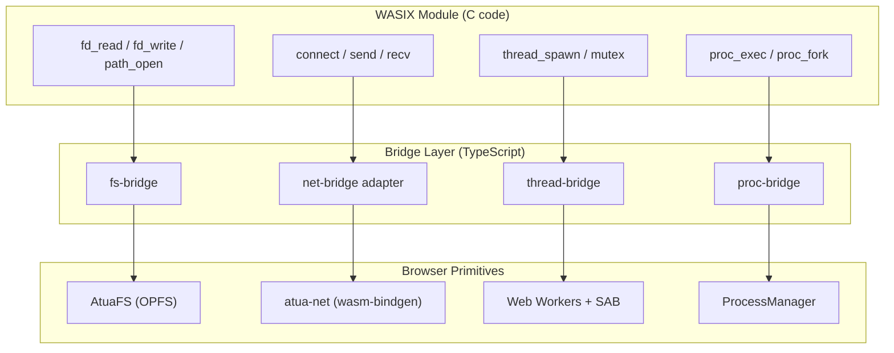

# WASIX Bridges — fs, thread, proc, and net adapter

## Overview

Implement the four WASIX bridge adapters that connect WASIX C libraries to browser primitives. These bridges are the plumbing between the WASIX world and the browser world — they handle filesystem access (AtuaFS), threading (Web Workers + SAB), process management (Worker isolation), and networking (atua-net adapter with future WASIX swap interface).

**Specs:** `spec:a7839341-19b5-40cd-999f-4fc68df128e4/9d8e95a2-8fa6-4df2-95e6-2f7c23480ac5` (Core Flows — Flow 4: Network Request via atua-net, Flow 5: WASIX C Library Execution), `spec:a7839341-19b5-40cd-999f-4fc68df128e4/032c3d97-9350-4506-a685-36f6891f8212` (Tech Plan — §3.2 WASIX Bridges table, §3.5 Net-Bridge Adapter Pattern)

**Dependencies:** `ticket:a7839341-19b5-40cd-999f-4fc68df128e4/8a35ff6a-9c66-4dd2-974c-055c673935ae` (Build Toolchain — need working WASIX compilation to test bridges against real WASM modules)

## Scope

### In Scope

**fs-bridge** — Maps WASIX filesystem syscalls to AtuaFS (OPFS-backed):
- Use `@wasmer/sdk` `Directory` mounts to share AtuaFS directories with WASIX modules
- WASIX modules see a POSIX-like filesystem via `fd_read`, `fd_write`, `path_open`, etc.
- Read/write through existing AtuaFS API — no new filesystem implementation needed
- Handle path translation between WASIX mount paths and AtuaFS paths

**thread-bridge** — Maps WASIX threading to Web Workers + SharedArrayBuffer:
- `@wasmer/sdk` handles `thread_spawn` automatically via Web Workers + SAB
- This bridge configures the thread pool settings and manages cleanup
- Expose mutex/condvar primitives that map to `Atomics.wait()`/`Atomics.notify()`

**proc-bridge** — Maps WASIX process operations to Worker isolation:
- `proc_exec` → spawn a new Worker with a fresh WASIX instance
- `proc_fork` → Wasmer memory snapshot + new Worker (if supported by `@wasmer/sdk`)
- Worker-to-Worker communication via `MessageChannel`
- Maps to existing Atua `ProcessManager` for Worker lifecycle

**net-bridge** — Adapter to atua-net with clean swap interface:
- Define the `NetBridge` interface: `connect(host, port, tls?) → StreamHandle`, `send(handle, data)`, `recv(handle) → data`, `close(handle)`, `fetch(url, opts) → Response`
- **Current implementation**: routes all calls to atua-net's `atua_connect()`, `atua_stream_send()`, `atua_stream_recv()`, `atua_stream_close()`, `atua_fetch()`
- **Swap interface**: the `NetBridge` interface is stable. A future `WasixNetBridge` implementation can route through WASIX `sock_*` syscalls when available, swappable at init time
- Map client-side libuv socket operations (`uv__tcp_connect`, stream send / recv / close) to `NetBridge.connect()` / `send()` / `recv()` / `close()`. `bind()` / `listen()` / `accept()` remain out of scope here and are handled separately by the host preview/server adapter when needed

### Out of Scope
- Actual C library compilation (bridges are tested with the hello.wasm validation module + small test C programs)
- Server-side listening (`sock_listen`, `sock_accept`) — deferred with µSockets/uWebSockets

## Acceptance Criteria

1. fs-bridge: A WASIX module can read/write files through AtuaFS — write a file in JS, read it from C; write in C, read from JS
2. thread-bridge: A WASIX module can spawn threads that execute concurrently and share memory via SAB
3. proc-bridge: A WASIX module can exec a subprocess (new Worker with fresh instance) and communicate via MessageChannel
4. net-bridge: `NetBridge.connect('example.com', 443, true)` routes through atua-net and returns a working stream. `NetBridge.fetch(url)` returns a response
5. net-bridge swap interface: `NetBridge` is an interface/abstract class. `AtuaNetBridge` is the concrete implementation. A second implementation can be swapped in at init time
6. Integration test: a C program compiled to WASIX reads a file (fs-bridge), makes an HTTP request (net-bridge), spawns a thread (thread-bridge), and all three work in the browser

